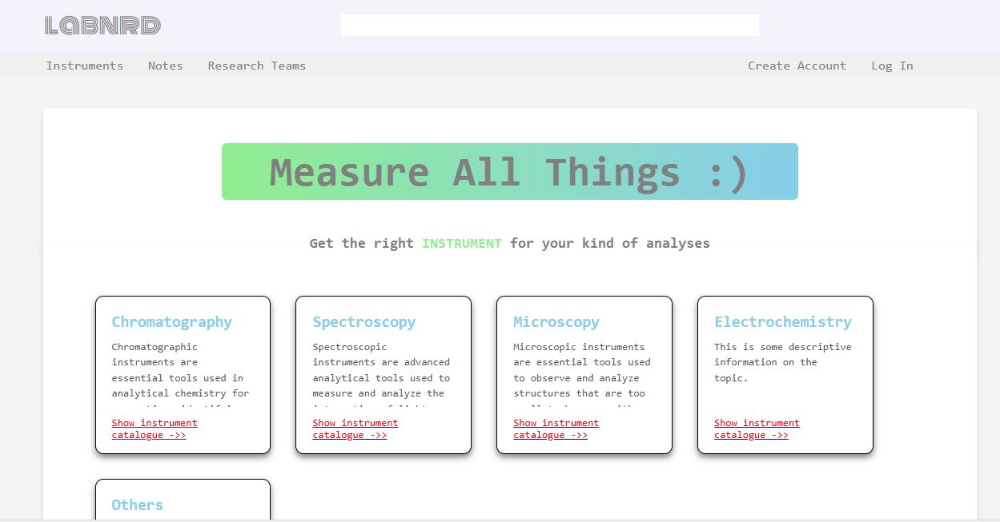
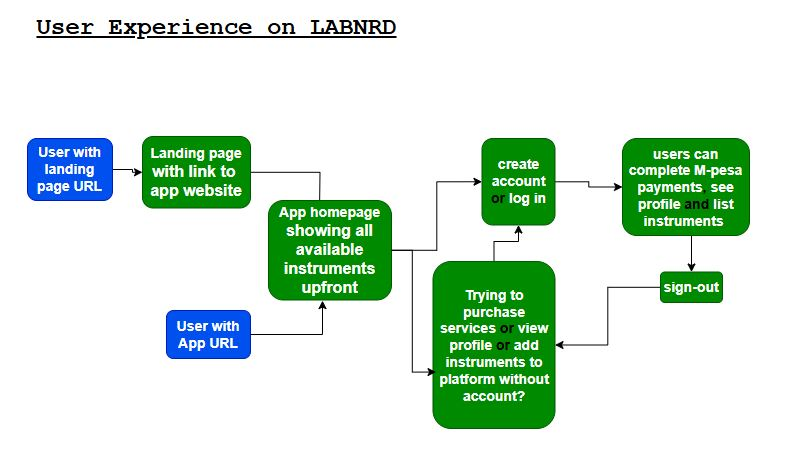
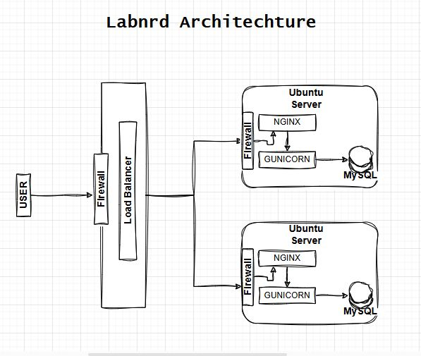

# Labnrd
An Analytical Chemistry instruments' locator and listing application.

## Introduction
The Labnrd project is a collation project seeking to build a database of physical locations where researchers and research students can access usage. Institutions can list and bill their instruments accordingly to make them available to a wider audience of potential users of their services.

For the deployed app https://www.characterize.tech

> **Key Features:**
> - Quick search instruments by name or listing institution.
> - Mpesa payment integration.
> - All your orders/listings in a single Dashboard.

## Installation
Labnrd is built in Python3.0

To run a local copy:
1. Clone the repository:

   ```bash
   git clone https://github.com/KimothoIbrahim/labnrd.git

2. Navigate to project directory

   cd labnrd/labnerdWorkingDirectory

3. Install required dependencies

   pip install -r requirements.txt

## Usage
  run locally ./labnerd.py
  or
  host with gunicorn
    'gunicorn --bind 0.0.0.0:8000 labnerd:app'

## Project Visuals

#### Labnrd Homepage

---
---
The flow of experience on labnerd is as in the following chart:


---
---
Labnerd is deployed by setting up two Linux (Ubuntu) VPS' with a fully secure MySQL database, configuring NGINX to serve static files and proxing all other traffic to GUNICORN to serve the application. User requests first hit a load-balancer which equally distributes traffic between the two servers. The firewall is UFW on both servers.
An illustration of these architecture is as below:
---


## Note
The first iteration of the Labnrd project is developed as portfolio project under the ALX SE program. It is born of my background in the chemistry field and the struggles of young reserchers who have no idea where to start with their academic projects, project budgets or even what to use.

**Future features will include:**
   Incorporating sales performace for in listing user accounts.
   Providing downloadable reciepts as proof of payment on the platform.
   Credit card payments buying users.
   Cashout options for listing users.
   A complete admin dashboard to precisely tailor your product listing as desired.

## License
This project is licensed under the MIT License - see the LICENSE file for details.

## Contact Information
For support and inquiries, please contact me at kimothoibrahim@yahoo.com

## Acknowledgements
Kimotho Ibrahim

Libraries
PIL,
Flask, wtf, forms, login.
